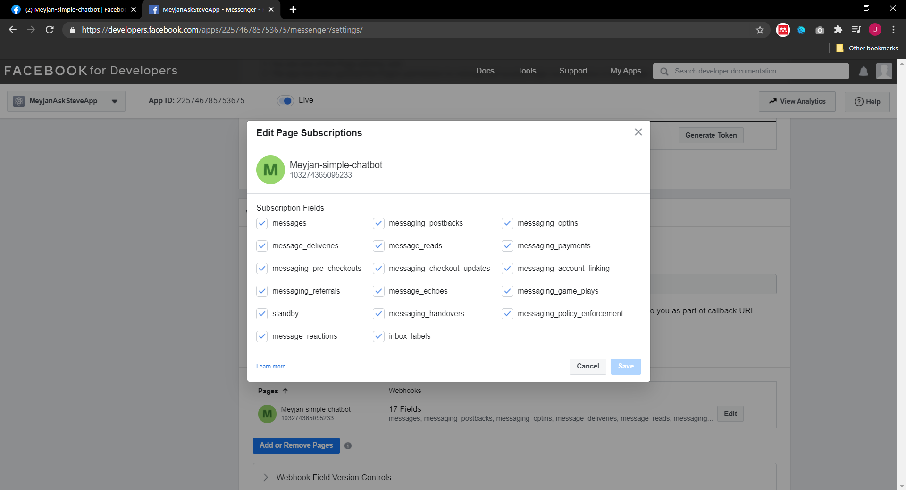

# AskSteveNode

## API Documentation
Link: https://documenter.getpostman.com/view/7623074/TVzYga52

## Description
A simple messenger webhook using NodeJS with Express framework. Data is stored in MongoDB database. This messenger can do the following:
1. Ask for name.
2. Ask for birth date.
3. Count how many days until next birthday.
4. Getting messages (with customer and message id filter).
5. Delete message.

The application is deployed on Heroku on [this link](meyjan-ask-steve.herokuapp.com). This application also deployed on Facebook for developers with AppId: 225746785753675

## Installation Guide
The installation guide is how to use this messenger webhook app for your Facebook Page or your application. There is a more comprehensive guide by Facebook at [this link](https://developers.facebook.com/docs/messenger-platform/getting-started/app-setup).

But for the steps that is taken to install this application is as follows.
### 1. Add Messenger Platform to Facebook App
This step is done so that your facebook page can start receiving messages that can be sent to this app to be processsed.

### 2. Configuring Webhook for this app
This step is done to create a webhook that will send events to the API to be processed.

### 3. Subscribe this app to a Facebook Page
This step is done to connect the application towards the facebook app. That way this application can now receive messages from facebook to be processed.

### 4. Using the Facebook Messenger Plugin for the Website
Lastly, you can also setup a messenger plugin to your own website that can sends the message towards this application.

